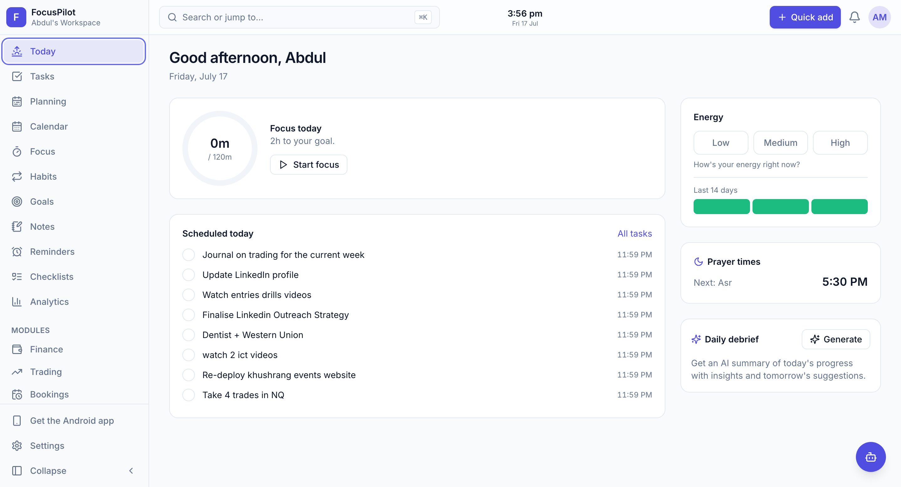
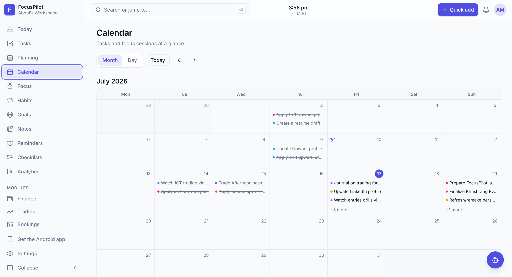
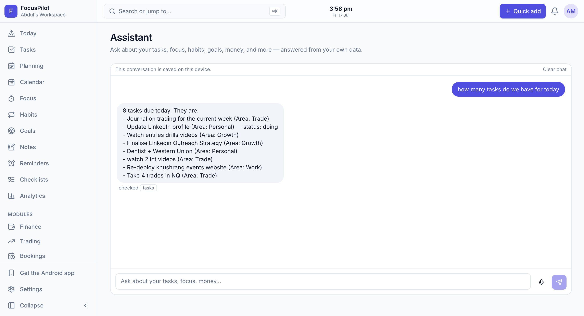
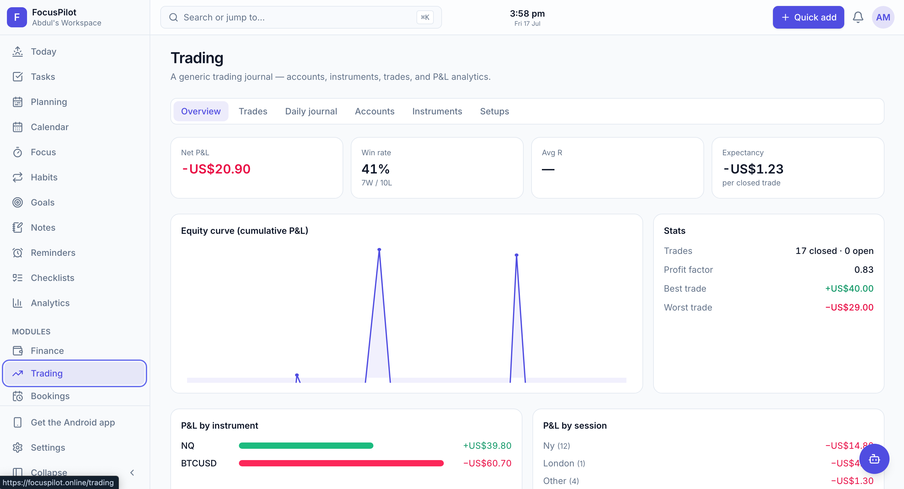

# FocusPilot

A multi-tenant productivity platform that replaces a stack of separate apps — tasks, focus timing, habits, notes, goals, finance, trading journal, and public booking pages — with one system, plus an AI assistant that can act on your data.

**🔗 Live at [focuspilot.online](https://focuspilot.online)** · Android app available

---

## The problem

Most people run their work life across five or six disconnected tools: one for tasks, another for notes, a spreadsheet for invoices, a separate calendar link for client calls. Nothing talks to anything else, so the context needed to actually plan a day is scattered and manual.

FocusPilot puts those workflows in a single tenant-scoped workspace, where a task, a focus session, a habit, and an invoice all share one data model. That's what makes the AI assistant useful — it can answer questions and take actions across every module because it's all one database.

## What it does

- **Tasks** — list, board, and calendar views with natural-language quick-add (`pay invoice fri 2pm #work !high`), subtasks, comments, and recurrence
- **Focus** — a Pomodoro timer that persists across navigation, attaches to a task, and rolls logged minutes back into it
- **Planning & Today** — drag a backlog into a day timeline with a capacity meter; a daily dashboard with a focus-goal ring and energy log
- **Habits, Notes, Checklists, Goals** — streak tracking, a markdown editor with full-text search, checklists with server-side reset cadences, and goals with milestone timelines
- **Finance** — invoices with line items, expenses, payables, clients, and a derived cashflow ledger; money handled as integer cents end-to-end
- **Trading journal** — accounts, instruments, and setups with auto-computed P&L and R-multiple, plus an equity curve, win rate, expectancy, and profit factor
- **Bookings** — public Calendly-style scheduling pages with timezone-aware slots, guest-timezone emails, and database-enforced double-booking prevention
- **AI assistant** — a tool-calling chat over your own data that proposes write actions for you to confirm before they run; supports voice notes via transcription
- **Notifications** — unified in-app, email, and push delivery (web push and native) with per-type user preferences
- **Modules** — Finance, Trading, Bookings, AI, and others are per-workspace feature flags; the whole UI adapts when one is toggled off

## Tech stack

**Web** — Next.js 15 (App Router) · React 19 · TypeScript 5 · Tailwind v4 · TanStack Query 5 · Zod 3

**Backend & data** — Next.js route handlers · Prisma 7 with the MariaDB adapter · MySQL 8 · better-auth (argon2id password hashing, database-backed sessions) · Node 22

**AI** — OpenAI and Gemini behind a provider abstraction called over raw `fetch`, with a deterministic mock provider for local development

**Mobile** — React Native 0.76 · Expo 52 · Expo Router · NativeWind, with offline-persisted queries and Expo push notifications

**Infrastructure** — Hostinger Node hosting, auto-deployed from `main` · MySQL 8 · SMTP via Nodemailer · VAPID web push · a secret-protected cron endpoint driving the background job queue

## Architecture

**Frontend.** A Next.js App Router application. Every feature is a vertical slice — Zod schema, service, REST route, TanStack Query hook, UI — so the codebase scales by repetition rather than special cases. Mutations are optimistic by default.

**Backend.** REST route handlers over a service layer, with a consistent response envelope and typed error codes. Two invariants hold everywhere: every query is scoped to a workspace resolved server-side (never from client input, and cross-tenant reads return 404 rather than leaking existence), and every mutable entity carries a version for optimistic concurrency, so conflicting writes get a 409 instead of silently overwriting.

**Database.** MySQL 8 via Prisma, 50+ models, all tenant-scoped by workspace. Config-shaped data lives in JSON columns so preferences evolve without migrations.

**Background jobs.** A database-backed job queue drained by a single protected cron tick handles reminders, overdue-invoice scans, and booking confirmations. Reminders are timezone-aware and idempotent per local day, and emails are deduplicated by a unique index — a retry can't double-send.

**AI assistant.** One entry point gates on the module flag, enforces per-user quota and rate limits, builds tenant-scoped context, validates model output against a Zod schema with a retry, and writes an audit row for every run including failures. The assistant itself is a separate tool-calling agent that proposes writes for explicit user confirmation rather than executing them directly.

**Android app.** An Expo / React Native client against the same API, sharing the auth and validation layer with the web app. Queries persist to storage for offline reads; push notifications route through Expo to FCM.

## Screenshots

Screenshots live in [`assets/`](assets/).

| | |
|---|---|
|  |  |
|  |  |

---

## Links

- **Portfolio** — [abdulmoiz.deltacreationco.com](https://abdulmoiz.deltacreationco.com)
- **LinkedIn** — [linkedin.com/in/abdulmoiz-automations](https://www.linkedin.com/in/abdulmoiz-automations/)

---

This repository is a showcase for FocusPilot. The product's source code is private. The MIT license here covers this README and its assets only.
